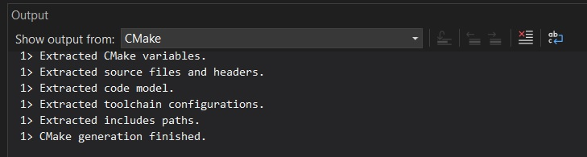
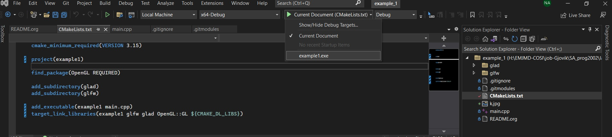
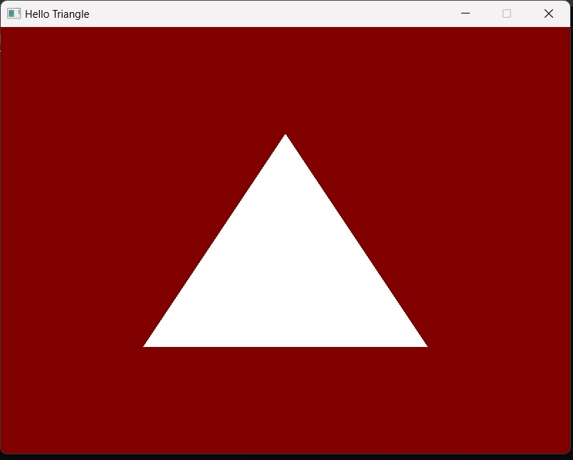
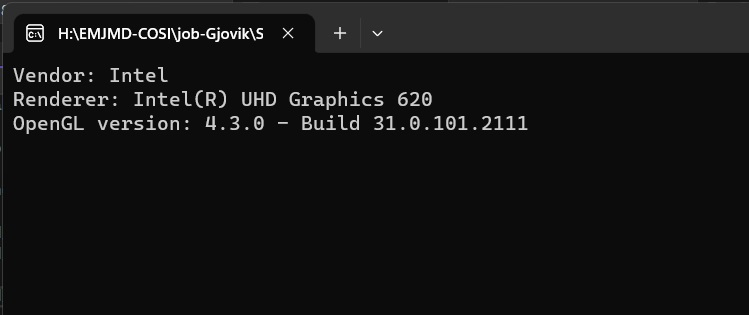

# Example 0: creating a simple OpenGL application
## PROG2002 -- Graphics Programming -- Autumn 2020
### By Rafael Palomar and Nafia Akter

#### Introduction

This example will be the first contact with some of the libraries that will be used
during the course. The objective of the example **is only testing your hardware,
libraries and development environment to make sure you are all set for the examples
and assignments**. This project is a concise example of:

- Creation of a simple OpenGL application using CMake, Git, GLFW and glad.
- Display a white triangle in over a red background.
- Printout drivers information, OpenGL version and profile.

You are free to use any operating system, however the instructions of this example
are only available for Microsoft Windows using Visual Studio and GNU/Linux systems (mostly
debian-based).

For Windows users, it is highly recommended to use Visual Studio.

* Pre-requisites

- OpenGL >= 4.3 :: OpenGL is the industry&rsquo;s most widely used, supported
  and best documented 2D/3D graphics API making it inexpensive and easy to obtain
  information on implementing OpenGL in hardware and software. You should try to
  get the latest graphics drivers available for your platform. On MS Windows,
  the header files will be bundled with your compiler; on GNU/Linux
  (debian-based systems) it is needed to install the *mesa-common-dev* package.
s

## Instructions for Windows using Visual Studio: 

**1.** Open a terminal window

**2.** Go to the folder where you would like to store the examples for this course with the ```cd``` command.

**3.** Enter the command below in the command line and press enter. This command uses the ```--recurse-submodules``` flag to clone both the "main" repository and the git submodules that are referred to in the various ".gitmodules" files that are included in the examples.

```bash
git clone --recurse-submodules https://git.gvk.idi.ntnu.no/course/prog2002/lecturers/autumn_2023/labs_assignment_issues.git
```

**4.** Open the "example1" folder in Visual Studio

**5.** Make sure that CMake successfully configures. This is what you should see on your output terminal:


 
**6.** press "Ctrl+Shift+B" to build the project. You should see "Build All succeeded." in the output terminal. 

**7.** Select the "example1.exe" file as Startup item, as shown below:



**8.** Click on the green arrow to run the file.

**9.** This is what you should see:


<br/>


- As shown in the lasts picture, you should be able to see what version of OpenGL you have.

## Instructions for Linux using the command-line: 

**1.** Install dependencies

```bash
apt install mesa-common-dev libxinerama-dev libxinput-dev libxi-dev
```

**2.** Clone the repository

   ```bash
   git clone https://github.com/rafaelpalomar/prog2002_lab01 --recursive
   ```

   Note the *--recursive* flag that will pull *glfw* as a submodule.

**3.** Create a folder for the project build (e.g., /home/rafael/prog2002_lab01/build)

**4.** Configure the project:
   ```bash
   cd /home/rafael/prog2002_lab01/build
   ```
   ```bash
   cmake ../
   ```
